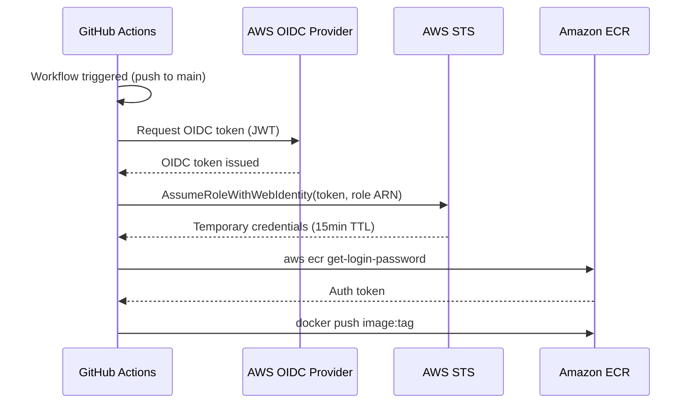
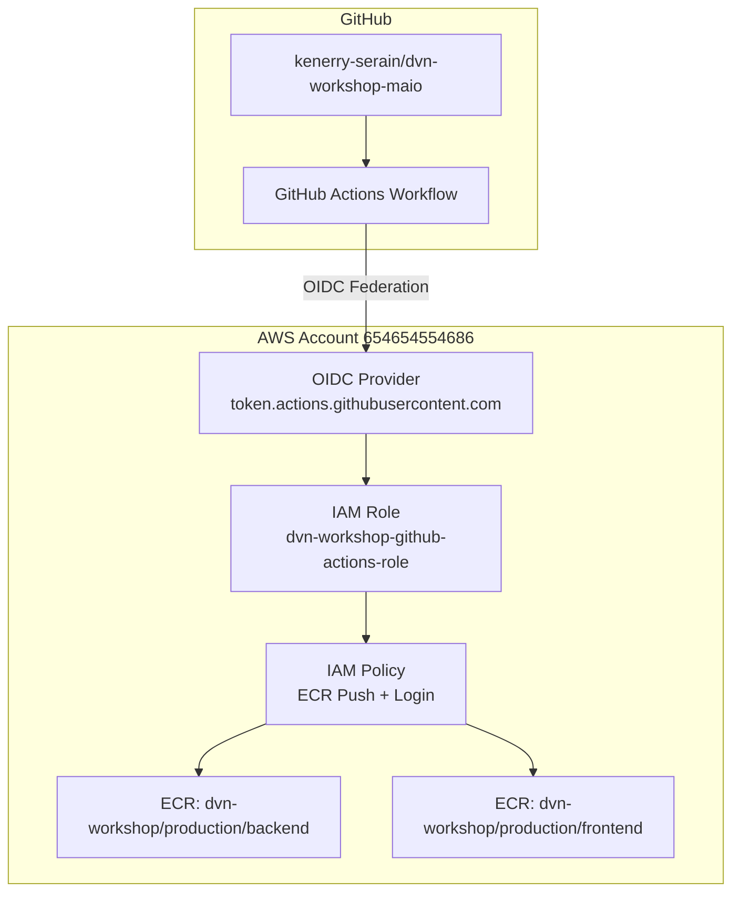

# ADR-0004: OIDC Provider e IAM Roles para Autenticacao GitHub Actions na AWS

## Status
Approved

## Data
2026-05-24

## Contexto

O projeto `dvn-workshop` precisa de uma pipeline de CI/CD no GitHub Actions para automatizar o build e push de imagens Docker para o ECR. A autenticacao do GitHub Actions na AWS e um passo fundamental que deve ser seguro, auditavel e seguir o principio de least privilege.

Atualmente, o projeto possui:
- **Cluster EKS** (`dvn-workshop-production`) na regiao `us-east-1`, provisionado pela stack `02-eks-stack-ai`
- **Repositorios ECR** para `frontend` e `backend` com nomes `dvn-workshop/production/frontend` e `dvn-workshop/production/backend`
- **Account ID**: `654654554686` (extraido dos URIs ECR nos manifestos Kubernetes)
- **Provider**: `hashicorp/aws ~> 6.0` (versao mais recente: **6.46.0**, validada via Terraform MCP Server)
- **Terraform**: >= 1.10.0
- **Backend S3**: `dvn-workshop-production-terraform-state`
- **Repositorio GitHub**: `kenerry-serain/dvn-workshop-maio`

A abordagem mais segura para autenticacao entre GitHub Actions e AWS e o uso de OIDC (OpenID Connect), eliminando a necessidade de armazenar credenciais de longa duracao (access keys) como secrets no GitHub.

### Constraints levantados no discovery

- **Provider**: exclusivamente `hashicorp/aws` -- sem modulos comunitarios (conforme regras do projeto)
- **Naming conventions**: conforme `.claude/rules/terraform-naming-conventions.md` -- variaveis como objetos agrupados, sem `default`, arquivo de valores em `envs/production.tfvars`
- **Stack pattern**: Nova stack `03-ci-cd-stack-ai` seguindo o padrao de numeracao sequencial
- **Principio de least privilege**: A role do GitHub Actions deve ter permissoes minimas -- apenas ECR push e acesso de leitura ao ECR para login
- **Restricao de federacao**: A trust policy deve restringir o assume role exclusivamente ao repositorio `kenerry-serain/dvn-workshop-maio` e a branch `main`

## Drivers da Decisao

- Eliminacao de credenciais de longa duracao armazenadas no GitHub (risco de vazamento)
- Conformidade com as melhores praticas da AWS para workloads federados
- Auditabilidade completa via CloudTrail de cada assume role realizado pelo GitHub Actions
- Principio de least privilege: permissoes restritas ao minimo necessario (ECR push)
- Integracao nativa do GitHub Actions com OIDC via action oficial `aws-actions/configure-aws-credentials`

## Opcoes Consideradas

### Opcao A: OIDC Provider + IAM Role com Trust Policy restrita (Recomendada)

- **Descricao**: Criar um `aws_iam_openid_connect_provider` para o GitHub (`token.actions.githubusercontent.com`), uma IAM Role com trust policy restrita ao repositorio e branch especificos, e uma IAM Policy com permissoes minimas para ECR (login, push de imagem).

- **Pros**:
  - Zero credenciais de longa duracao armazenadas
  - Tokens OIDC sao de curta duracao (validos apenas durante a execucao do workflow)
  - Trust policy restringe a federacao a um repositorio/branch especifico, prevenindo lateral movement
  - Auditoria completa via CloudTrail (cada `AssumeRoleWithWebIdentity` e logado)
  - Action oficial da AWS (`aws-actions/configure-aws-credentials@v4`) suporta OIDC nativamente
  - Validado pelo pilar de Seguranca do Well-Architected Framework
  - `thumbprint_list` e opcional para GitHub (AWS usa sua propria biblioteca de CAs trusted -- confirmado via Terraform MCP Server na documentacao do recurso `aws_iam_openid_connect_provider`)

- **Contras**:
  - Requer criacao de recursos Terraform adicionais (OIDC provider, role, policy)
  - Se o OIDC provider for deletado acidentalmente, todas as pipelines param

- **Custo estimado**: $0/mes (IAM e OIDC provider nao tem custo)

### Opcao B: IAM User com Access Keys armazenadas como GitHub Secrets

- **Descricao**: Criar um IAM User com access key e secret key, armazena-los como GitHub Secrets, e usa-los diretamente no workflow.

- **Pros**:
  - Configuracao mais simples (sem OIDC, sem trust policy)
  - Funciona imediatamente com `aws-actions/configure-aws-credentials`

- **Contras**:
  - Credenciais de longa duracao armazenadas externamente (risco de vazamento)
  - Rotacao manual de keys necessaria (overhead operacional)
  - Viola o principio de least privilege temporal (keys validas 24/7, mesmo sem pipeline rodando)
  - Nao recomendado pela AWS -- pratica desencorajada em todos os guias de seguranca
  - CloudTrail loga o user, mas nao distingue entre execucoes de pipeline
  - Viola o pilar de Seguranca do Well-Architected Framework

- **Custo estimado**: $0/mes (IAM User nao tem custo direto, mas o risco de seguranca tem custo potencial alto)

## Decisao

**Opcao A: OIDC Provider + IAM Role com Trust Policy restrita**.

Justificativa contra os 6 pilares do Well-Architected:

1. **Operational Excellence**: O OIDC provider e configurado uma vez e funciona automaticamente. Nao ha necessidade de rotacao de credenciais. A action `aws-actions/configure-aws-credentials@v4` abstrai toda a complexidade do assume role.

2. **Security**: Zero credenciais de longa duracao. Trust policy restrita a `repo:kenerry-serain/dvn-workshop-maio:ref:refs/heads/main`. Tokens OIDC tem vida util de minutos. Cada execucao e auditavel via CloudTrail com o claim `sub` do token.

3. **Reliability**: OIDC e um protocolo padrao, suportado nativamente pela AWS e GitHub. Nao ha dependencia de rotacao de secrets que poderia causar downtime da pipeline.

4. **Performance Efficiency**: Sem impacto. O tempo de assume role via OIDC e negligivel (~1-2 segundos).

5. **Cost Optimization**: $0/mes. IAM e OIDC nao tem custo.

6. **Sustainability**: Nenhum recurso computacional adicional alocado.

## Consequencias

- **Positivas**:
  - Pipeline de CI/CD segura sem credenciais persistentes
  - Auditabilidade completa de todas as interacoes AWS do GitHub Actions
  - Conformidade com AWS Security Best Practices
  - Escalabilidade: mesma abordagem pode ser replicada para outros repositorios

- **Negativas / Trade-offs aceitos**:
  - Complexidade inicial ligeiramente maior vs access keys (mitigada pela documentacao e pelo ADR)
  - Dependencia do OIDC provider -- se deletado, pipelines param

- **Riscos e mitigacoes**:
  - *Risco*: Delecao acidental do OIDC provider. *Mitigacao*: Terraform state protegido com lifecycle `prevent_destroy`, alem de backup no S3 com versionamento.
  - *Risco*: Trust policy excessivamente permissiva. *Mitigacao*: Condition restrita a `repo:kenerry-serain/dvn-workshop-maio:ref:refs/heads/main` -- nao aceita forks, PRs de forks, ou outras branches.

## Diagrama





## Implementation Guidelines (para o DevOps Engineer Agent)

- **IaC stack**: Terraform >= 1.10.0, provider `hashicorp/aws ~> 6.0` (versao atual: 6.46.0)
- **Nova stack**: `dvn-workshop-terraform/03-ci-cd-stack-ai/`
- **Recursos Terraform necessarios** (todos validados via Terraform MCP Server):
  1. `aws_iam_openid_connect_provider` (providerDocID: 12310858) -- OIDC provider para GitHub
  2. `aws_iam_role` (providerDocID: 12310863) -- Role para GitHub Actions com trust policy OIDC
  3. `aws_iam_policy` (providerDocID: 12310861) -- Policy com permissoes ECR
  4. `aws_iam_role_policy_attachment` (providerDocID: 12310866) -- Attachment da policy a role

- **Estrutura de arquivos** (seguindo convencoes do projeto):
  ```
  03-ci-cd-stack-ai/
  ├── versions.tf
  ├── main.tf
  ├── variables.tf
  ├── outputs.tf
  ├── tags.tf
  ├── oidc.tf                           # aws_iam_openid_connect_provider
  ├── oidc.iam.tf                       # IAM Role + Trust Policy + Policy + Attachment
  └── envs/
      └── production.tfvars
  ```

- **Configuracao do OIDC Provider**:
  - URL: `https://token.actions.githubusercontent.com`
  - Client ID list: `["sts.amazonaws.com"]`
  - `thumbprint_list`: omitir (AWS usa CAs trusted para GitHub -- confirmado na documentacao do provider)

- **Trust Policy da IAM Role** (condicoes criticas):
  - `StringEquals` em `token.actions.githubusercontent.com:aud` = `sts.amazonaws.com`
  - `StringLike` em `token.actions.githubusercontent.com:sub` = `repo:kenerry-serain/dvn-workshop-maio:ref:refs/heads/main`
  - Principal: `Federated` apontando para o ARN do OIDC provider
  - Action: `sts:AssumeRoleWithWebIdentity`

- **IAM Policy (ECR permissions)**:
  ```json
  {
    "Version": "2012-10-17",
    "Statement": [
      {
        "Sid": "ECRLogin",
        "Effect": "Allow",
        "Action": "ecr:GetAuthorizationToken",
        "Resource": "*"
      },
      {
        "Sid": "ECRPush",
        "Effect": "Allow",
        "Action": [
          "ecr:BatchCheckLayerAvailability",
          "ecr:GetDownloadUrlForLayer",
          "ecr:BatchGetImage",
          "ecr:PutImage",
          "ecr:InitiateLayerUpload",
          "ecr:UploadLayerPart",
          "ecr:CompleteLayerUpload"
        ],
        "Resource": [
          "arn:aws:ecr:us-east-1:654654554686:repository/dvn-workshop/production/backend",
          "arn:aws:ecr:us-east-1:654654554686:repository/dvn-workshop/production/frontend"
        ]
      }
    ]
  }
  ```

- **Variaveis** (objeto agrupado, sem defaults):
  ```hcl
  variable "github_actions" {
    type = object({
      oidc_provider_url   = string
      github_org          = string
      github_repo         = string
      allowed_branches    = list(string)
      role_name           = string
      ecr_repository_arns = list(string)
    })
  }
  ```

- **Outputs esperados**:
  - `oidc_provider_arn`
  - `github_actions_role_arn`
  - `github_actions_role_name`

- **Ordem de execucao**: Stack 02 (EKS + ECR) deve estar provisionada antes. A stack 03 depende dos ARNs dos repositorios ECR.

- **Validacoes pos-deploy**:
  - Verificar se o OIDC provider existe: `aws iam list-open-id-connect-providers`
  - Simular assume role: `aws sts assume-role-with-web-identity` (requer token real do GitHub)
  - Verificar policy attachments: `aws iam list-attached-role-policies --role-name <role-name>`

- **Rollback strategy**: `terraform destroy` da stack 03. Nenhum dado e perdido pois sao apenas recursos IAM.

## Observabilidade e Day-2

- **Metricas-chave**:
  - `AssumeRoleWithWebIdentity` calls no CloudTrail
  - ECR push success/failure rate

- **Alarmes recomendados**:
  - CloudTrail alert para `AssumeRoleWithWebIdentity` de sources inesperados (fora do repositorio configurado)
  - Falhas de `AssumeRoleWithWebIdentity` (indica possivel misconfiguracao ou tentativa de acesso nao autorizado)

- **Dashboards**: CloudTrail Insights para visualizar padroes de uso da role

- **Runbooks necessarios**:
  - Procedimento de recriacao do OIDC provider em caso de delecao acidental
  - Procedimento de atualizacao da trust policy para adicionar novas branches ou repositorios

- **Backup e DR**: State do Terraform em S3 com versionamento e encrypt. OIDC provider pode ser recriado via Terraform em minutos.

## Seguranca

- **IAM (least privilege)**:
  - Role restrita a ECR push apenas nos repositorios `dvn-workshop/production/backend` e `dvn-workshop/production/frontend`
  - `ecr:GetAuthorizationToken` em `Resource: "*"` (obrigatorio pela API -- nao aceita resource-level restriction)
  - Trust policy com condition `StringEquals` e `StringLike` para restringir federacao
  - Nao inclui permissoes de delete, create repository, ou policy changes

- **Criptografia**: N/A para este ADR (OIDC tokens sao transmitidos via HTTPS nativamente)

- **Network segmentation**: N/A (IAM e global, nao depende de VPC)

- **Logging e auditoria**:
  - CloudTrail registra todo `AssumeRoleWithWebIdentity` com detalhes do token OIDC
  - IAM Access Analyzer pode ser utilizado para validar que a policy nao e excessivamente permissiva

## Custo Estimado

- **Mensal aproximado**: $0/mes
- **Principais drivers de custo**: IAM, STS e OIDC provider nao tem custo direto
- **Oportunidades de otimizacao futura**: N/A

## Referencias

- AWS Well-Architected: [Security Pillar - Identity and Access Management](https://docs.aws.amazon.com/wellarchitected/latest/security-pillar/identity-and-access-management.html)
- [Configuring OpenID Connect in Amazon Web Services (GitHub Docs)](https://docs.github.com/en/actions/security-for-github-actions/security-hardening-your-deployments/configuring-openid-connect-in-amazon-web-services)
- [aws-actions/configure-aws-credentials](https://github.com/aws-actions/configure-aws-credentials)
- Terraform: `aws_iam_openid_connect_provider` (provider hashicorp/aws 6.46.0)
- Terraform: `aws_iam_role` (provider hashicorp/aws 6.46.0)
- Terraform: `aws_iam_policy` (provider hashicorp/aws 6.46.0)
- ADRs relacionados: ADR-0003 (EKS Cluster), ADR-0005 (GitHub Actions Pipeline), ADR-0006 (ArgoCD)
