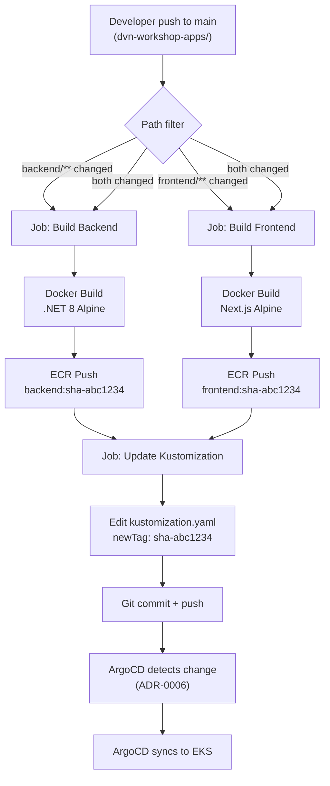
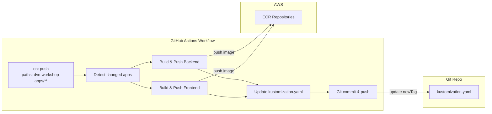

# ADR-0005: Pipeline GitHub Actions para CI/CD com GitOps Pattern

## Status
Approved

## Data
2026-05-24

## Contexto

O projeto `dvn-workshop` possui duas aplicacoes que precisam de automacao de CI/CD:
- **Backend**: .NET 8 (ASP.NET Core), localizado em `dvn-workshop-apps/backend/YoutubeLiveApp/`
- **Frontend**: Next.js (Node 20), localizado em `dvn-workshop-apps/frontend/youtube-live-app/`

Ambas as aplicacoes ja possuem Dockerfiles otimizados (multi-stage, alpine, rootless, healthcheck) e repositorios ECR provisionados:
- `654654554686.dkr.ecr.us-east-1.amazonaws.com/dvn-workshop/production/backend`
- `654654554686.dkr.ecr.us-east-1.amazonaws.com/dvn-workshop/production/frontend`

Os manifestos Kubernetes estao organizados em `dvn-workshop-kubernetes/` com um `kustomization.yaml` na raiz que referencia os recursos de backend e frontend e controla as tags das imagens via bloco `images`.

A pipeline precisa:
1. Detectar mudancas nos diretorios das aplicacoes
2. Buildar a imagem Docker
3. Fazer push para o ECR
4. Atualizar a tag no `kustomization.yaml`
5. Fazer commit automatico da mudanca (GitOps pattern)

O ArgoCD (configurado no ADR-0006) detectara a mudanca no `kustomization.yaml` e fara o deploy automaticamente.

### Constraints levantados no discovery

- **Autenticacao**: Via OIDC (conforme ADR-0004) -- sem access keys
- **Repositorio**: `kenerry-serain/dvn-workshop-maio` (monorepo)
- **Branch principal**: `main`
- **Tag strategy**: SHA curto do commit (`sha-<7chars>`) para rastreabilidade
- **Kustomization path**: `dvn-workshop-kubernetes/kustomization.yaml`
- **Imagens ECR**: Tags controladas pelo bloco `images` do Kustomization
- **GitOps**: O commit automatico no `kustomization.yaml` e o trigger para o ArgoCD -- a pipeline NAO faz deploy direto no cluster

## Drivers da Decisao

- Automatizacao completa do ciclo build-push-deploy sem intervencao manual
- Rastreabilidade: cada imagem no ECR deve ser mapeavel a um commit especifico
- Separacao de responsabilidades: CI (GitHub Actions) faz build/push, CD (ArgoCD) faz deploy
- GitOps: o repositorio Git e a unica fonte de verdade para o estado desejado do cluster
- Path filtering: mudancas em `dvn-workshop-terraform/` ou `docs/` nao devem triggerar build de imagens

## Opcoes Consideradas

### Opcao A: Workflow unico com matrix strategy e path filter (Recomendada)

- **Descricao**: Um unico arquivo de workflow (`.github/workflows/ci-cd.yml`) que usa `paths` filter para triggerar apenas quando mudancas ocorrem nos diretorios das aplicacoes. Utiliza matrix strategy para buildar backend e frontend em paralelo quando ambos mudam. Apos o push das imagens, um job separado atualiza o `kustomization.yaml` e faz commit.

- **Pros**:
  - Um unico workflow para gerenciar, reduzindo duplicacao
  - Matrix strategy permite build paralelo de backend e frontend
  - Path filter evita builds desnecessarios (mudancas em Terraform, docs, etc.)
  - Separacao clara entre jobs de build e job de update/commit
  - Tag baseada em SHA garante rastreabilidade total
  - Workflow reutilizavel para adicionar novas aplicacoes no futuro

- **Contras**:
  - Matrix strategy requer logica condicional para detectar quais apps mudaram
  - Um unico workflow pode ficar complexo com o tempo
  - Se apenas uma app mudar, o commit do kustomization atualiza apenas uma tag

- **Custo estimado**: $0/mes (GitHub Actions free tier para repositorios publicos; para privados, 2000min/mes no plano Free, 3000min/mes no plano Pro)

### Opcao B: Workflows separados por aplicacao

- **Descricao**: Dois workflows separados -- `ci-cd-backend.yml` e `ci-cd-frontend.yml` -- cada um com seu proprio path filter e logica independente.

- **Pros**:
  - Cada workflow e mais simples e facil de entender
  - Falha em um nao afeta o outro
  - Logs separados para cada aplicacao

- **Contras**:
  - Duplicacao significativa de codigo entre workflows
  - Se ambos triggeram simultaneamente, podem haver race conditions no commit do `kustomization.yaml` (dois workflows tentando commitar no mesmo arquivo)
  - Mais arquivos para manter e sincronizar

- **Custo estimado**: $0/mes (mesmo custo da Opcao A)

### Opcao C: Reusable workflow com workflow_call

- **Descricao**: Um workflow reutilizavel (`.github/workflows/build-push.yml`) chamado por dois workflows trigger (`ci-cd-backend.yml` e `ci-cd-frontend.yml`).

- **Pros**:
  - Elimina duplicacao de codigo via reuso
  - Cada app tem seu proprio trigger com path filter
  - Modular e extensivel

- **Contras**:
  - Complexidade adicional com `workflow_call`, inputs e secrets
  - Mesma race condition do `kustomization.yaml` da Opcao B
  - Debugging mais complexo (workflow chamador + workflow reutilizavel)

- **Custo estimado**: $0/mes

## Decisao

**Opcao A: Workflow unico com matrix strategy e path filter**.

Justificativa contra os 6 pilares do Well-Architected:

1. **Operational Excellence**: Workflow unico reduz a superficie de manutencao. Path filter evita execucoes desnecessarias. O commit automatico no kustomization elimina intervencao manual no ciclo de deploy.

2. **Security**: Autenticacao via OIDC (ADR-0004) -- zero credenciais persistentes. O token do GitHub (`GITHUB_TOKEN`) com permissao `contents: write` e usado para o commit automatico, com escopo limitado ao repositorio. O workflow usa `permissions` explicitas para restringir o GITHUB_TOKEN.

3. **Reliability**: Path filter garante que apenas mudancas relevantes triggeram builds. O job de commit do kustomization e sequencial (depois dos builds), eliminando race conditions. Se um build falha, o kustomization nao e atualizado.

4. **Performance Efficiency**: Matrix strategy permite builds paralelos de backend e frontend. Docker layer caching via `actions/cache` ou `docker/build-push-action` com cache reduz tempo de build.

5. **Cost Optimization**: Path filter evita builds desnecessarios, economizando minutos do GitHub Actions. Um unico workflow consome menos runner time que dois workflows separados com overhead de startup.

6. **Sustainability**: Builds sao executados apenas quando necessario (path filter). Docker layer cache reduz reprocessamento.

## Consequencias

- **Positivas**:
  - Ciclo de deploy totalmente automatizado: push -> build -> push ECR -> update kustomization -> commit -> ArgoCD sync
  - Rastreabilidade completa: tag da imagem = SHA do commit que a gerou
  - GitOps: repositorio Git como unica fonte de verdade
  - Zero intervencao manual no deploy

- **Negativas / Trade-offs aceitos**:
  - O workflow usa `git push` automatico, o que gera um novo commit no historico (aceito em favor da automacao)
  - O commit automatico do kustomization pode triggerar o workflow novamente se os paths nao forem configurados corretamente -- mitigado com path filter que exclui `dvn-workshop-kubernetes/`
  - O `GITHUB_TOKEN` precisa de permissao `contents: write` para fazer commit

- **Riscos e mitigacoes**:
  - *Risco*: Loop infinito de triggers (commit do kustomization triggera novo build). *Mitigacao*: Path filter inclui apenas `dvn-workshop-apps/backend/**` e `dvn-workshop-apps/frontend/**`, excluindo `dvn-workshop-kubernetes/`.
  - *Risco*: Build falha apos push parcial de layer. *Mitigacao*: ECR usa content-addressable storage; layers orfas nao afetam imagens. Lifecycle policies no ECR podem limpar imagens nao taggeadas.
  - *Risco*: Commit do kustomization falha (conflito de merge). *Mitigacao*: O job faz `git pull --rebase` antes do push.

## Diagrama





## Implementation Guidelines (para o DevOps Engineer Agent)

- **Arquivo do workflow**: `.github/workflows/ci-cd.yml`

- **Estrutura do workflow**:
  ```
  .github/
  └── workflows/
      └── ci-cd.yml
  ```

- **Trigger configuration**:
  - `on.push.branches`: `[main]`
  - `on.push.paths`: `['dvn-workshop-apps/backend/**', 'dvn-workshop-apps/frontend/**']`

- **Permissions do workflow**:
  - `id-token: write` (para OIDC)
  - `contents: write` (para commit do kustomization)

- **Jobs**:

  1. **Job `detect-changes`**:
     - Usa `dorny/paths-filter@v3` ou logica com `git diff` para detectar quais apps mudaram
     - Outputs: `backend_changed`, `frontend_changed`

  2. **Job `build-push`** (matrix ou condicional, depende de `detect-changes`):
     - `needs: detect-changes`
     - Condicional: `if: needs.detect-changes.outputs.backend_changed == 'true'` (e similar para frontend)
     - Steps:
       a. `actions/checkout@v4`
       b. `aws-actions/configure-aws-credentials@v4` com OIDC (role ARN do ADR-0004)
       c. `aws-actions/amazon-ecr-login@v2`
       d. Docker build com tag `sha-${{ github.sha }}` (7 chars)
       e. Docker push para ECR
     - Configuracao do build context:
       - Backend: `dvn-workshop-apps/backend/YoutubeLiveApp/`
       - Frontend: `dvn-workshop-apps/frontend/youtube-live-app/`

  3. **Job `update-kustomization`**:
     - `needs: build-push`
     - Steps:
       a. `actions/checkout@v4` com `fetch-depth: 0`
       b. Configurar git user (ex: `github-actions[bot]`)
       c. Usar `kustomize edit set image` ou `sed`/`yq` para atualizar o `newTag` em `dvn-workshop-kubernetes/kustomization.yaml`
       d. `git add dvn-workshop-kubernetes/kustomization.yaml`
       e. `git commit -m "ci: update image tags to sha-<hash> [skip ci]"`
       f. `git pull --rebase origin main`
       g. `git push origin main`
     - Nota: `[skip ci]` no commit message previne loop infinito (funcionalidade nativa do GitHub Actions)

- **Tag strategy**: `sha-$(echo ${{ github.sha }} | cut -c1-7)` -- 7 caracteres do SHA do commit

- **ECR image URIs**:
  - Backend: `654654554686.dkr.ecr.us-east-1.amazonaws.com/dvn-workshop/production/backend:sha-<hash>`
  - Frontend: `654654554686.dkr.ecr.us-east-1.amazonaws.com/dvn-workshop/production/frontend:sha-<hash>`

- **Kustomization update**: O bloco `images` no `kustomization.yaml` deve ter o `newTag` atualizado para o SHA curto do commit

- **Environment variables / Secrets necessarios**:
  - `AWS_REGION`: `us-east-1` (pode ser hardcoded ou var de ambiente)
  - `AWS_ROLE_ARN`: ARN da role criada no ADR-0004 (armazenar como GitHub Actions variable ou secret)
  - `ECR_REGISTRY`: `654654554686.dkr.ecr.us-east-1.amazonaws.com`
  - Nenhum secret de credencial AWS necessario (OIDC)

- **Validacoes pos-deploy**:
  - Verificar se a imagem existe no ECR com a tag correta: `aws ecr describe-images --repository-name dvn-workshop/production/backend --image-ids imageTag=sha-<hash>`
  - Verificar se o commit do kustomization foi feito: `git log -1 --oneline`
  - Verificar se o GitHub Actions workflow executou com sucesso: `gh run list`

- **Rollback strategy**: Reverter o commit do kustomization (git revert) para voltar a tag anterior. O ArgoCD detectara a mudanca e fara rollback automatico.

## Observabilidade e Day-2

- **Metricas-chave**:
  - Workflow duration (GitHub Actions built-in)
  - Build success/failure rate por aplicacao
  - ECR push latency
  - Numero de imagens no ECR por repositorio

- **Alarmes recomendados**:
  - Workflow failure notification via GitHub Actions (built-in email ou Slack integration)
  - ECR repository approaching storage limit

- **Dashboards**:
  - GitHub Actions workflow runs (built-in UI)
  - ECR image scan findings (AWS Console ou CloudWatch)

- **Runbooks necessarios**:
  - Procedimento para rebuild manual de uma imagem (re-run workflow)
  - Procedimento para rollback de uma imagem (revert commit do kustomization)
  - Procedimento para limpar imagens antigas do ECR (lifecycle policy)

- **Backup e DR**: O workflow e versionado no Git. O historico de commits do kustomization serve como audit trail de todas as versoes deployadas.

## Seguranca

- **IAM (least privilege)**:
  - Role OIDC com permissoes apenas para ECR push (conforme ADR-0004)
  - `GITHUB_TOKEN` com permissoes explicitas (`id-token: write`, `contents: write`) -- nao usa permissoes default

- **Criptografia**:
  - Imagens no ECR encriptadas com AES-256 (default do ECR)
  - Comunicacao GitHub -> AWS via HTTPS (TLS 1.2+)
  - OIDC tokens assinados e verificados via JWKS

- **Network segmentation**: N/A (GitHub Actions runners sao hosted, comunicam com ECR via endpoint publico)

- **Logging e auditoria**:
  - GitHub Actions logs retidos por 90 dias (default)
  - CloudTrail loga todas as chamadas ao ECR e STS
  - Git history preserva todas as mudancas no kustomization

- **Supply chain security**:
  - ECR scan on push habilitado (ja configurado na stack 02)
  - Actions pinadas por versao (`@v4`, `@v3`) -- considerar pinar por SHA para seguranca maxima
  - Dockerfiles usam imagens base com tag especifica (nao `latest`)

## Custo Estimado

- **Mensal aproximado**: $0 (repositorio publico) ou incluso no plano GitHub (repositorio privado com 2000-3000 min/mes free)
- **Principais drivers de custo**:
  - Minutos de GitHub Actions runner (Linux: ~$0.008/min se exceder free tier)
  - ECR storage: ~$0.10/GB/mes (estimado ~2-5GB com imagens Alpine otimizadas)
  - ECR data transfer: free dentro da mesma regiao (EKS nodes puxam de `us-east-1`)
- **Oportunidades de otimizacao futura**:
  - Docker layer caching para reduzir tempo de build
  - ECR lifecycle policy para limpar imagens antigas (manter apenas as ultimas N tags)
  - Self-hosted runners para eliminacao de custo de minutos (se volume crescer)

## Referencias

- AWS Well-Architected: [Operational Excellence Pillar](https://docs.aws.amazon.com/wellarchitected/latest/operational-excellence-pillar/welcome.html)
- [GitHub Actions Documentation](https://docs.github.com/en/actions)
- [aws-actions/configure-aws-credentials](https://github.com/aws-actions/configure-aws-credentials)
- [aws-actions/amazon-ecr-login](https://github.com/aws-actions/amazon-ecr-login)
- [dorny/paths-filter](https://github.com/dorny/paths-filter)
- [Kustomize Documentation](https://kustomize.io/)
- ADRs relacionados: ADR-0004 (OIDC + IAM), ADR-0006 (ArgoCD)
