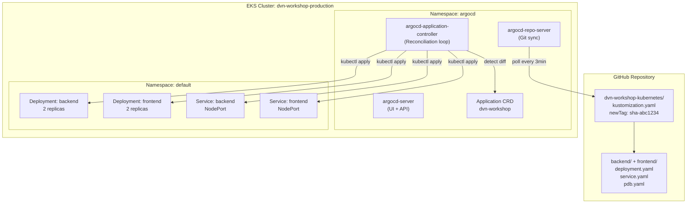
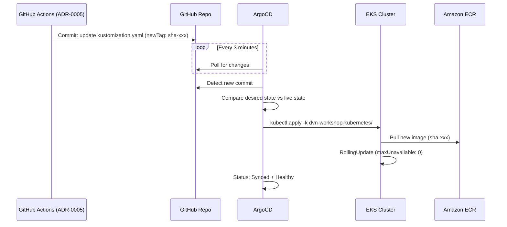

# ADR-0006: ArgoCD para GitOps Continuous Delivery no EKS

## Status
Approved

## Data
2026-05-24

## Contexto

O projeto `dvn-workshop` precisa de uma ferramenta de Continuous Delivery que implemente o padrao GitOps para deployer automaticamente as aplicacoes frontend e backend no cluster EKS (`dvn-workshop-production`, regiao `us-east-1`, Kubernetes 1.31).

A pipeline de CI/CD (ADR-0005) faz build das imagens Docker, push para o ECR, e atualiza o `kustomization.yaml` no repositorio Git com a nova tag da imagem. O proximo passo e um operador GitOps que monitore o repositorio e aplique as mudancas automaticamente no cluster.

### Estado atual do cluster

- **EKS**: `dvn-workshop-production`, versao 1.31, regiao `us-east-1`
- **Node group**: 2x `t3.medium` ON_DEMAND, subnets privadas, disk 20GB
- **Addons instalados**: vpc-cni, coredns, kube-proxy
- **Manifestos**: Kustomize com `kustomization.yaml` em `dvn-workshop-kubernetes/`
- **Aplicacoes**: backend (.NET 8, porta 8080) e frontend (Next.js, porta 3000), ambas com 2 replicas, probes, PDB, security context rootless
- **ECR**: Repositorios `dvn-workshop/production/backend` e `dvn-workshop/production/frontend`

### Constraints levantados no discovery

- **Repositorio unico**: O mesmo repositorio (`kenerry-serain/dvn-workshop-maio`) contem codigo das apps, manifestos Kubernetes e IaC -- monorepo
- **Kustomize**: Ja em uso para gerenciar manifestos (nao Helm)
- **Acesso ao cluster**: EKS com endpoint publico + privado, autenticacao via `API_AND_CONFIG_MAP`
- **Capacidade dos nodes**: 2x `t3.medium` (2 vCPU, 4GB RAM cada) -- ArgoCD precisa caber nos recursos disponiveis
- **Workshop context**: Ambiente de workshop/aprendizado -- simplicidade e preferida sobre alta disponibilidade do ArgoCD

## Drivers da Decisao

- GitOps como padrao de deployment: Git e a unica fonte de verdade
- Deteccao automatica de mudancas no `kustomization.yaml` e sync para o cluster
- Visibilidade do estado de sync entre Git e cluster (drift detection)
- Auto-healing: se alguem modificar o cluster manualmente, ArgoCD corrige automaticamente
- Interface web para visualizacao do estado dos deployments

## Opcoes Consideradas

### Opcao A: ArgoCD instalado via manifests oficiais com Application CRD (Recomendada)

- **Descricao**: Instalar o ArgoCD no cluster EKS usando os manifests oficiais de instalacao (namespace `argocd`), e configurar um recurso `Application` que monitora o diretorio `dvn-workshop-kubernetes/` do repositorio GitHub. O ArgoCD detecta mudancas no `kustomization.yaml` e faz sync automatico.

- **Pros**:
  - Ferramenta mais madura e adotada para GitOps no Kubernetes (CNCF Graduated)
  - Suporte nativo a Kustomize (nao requer plugins)
  - Interface web rica para visualizacao de recursos e estado de sync
  - Auto-sync com self-heal e auto-prune
  - Drift detection: alerta quando o cluster diverge do estado desejado no Git
  - CLI (`argocd`) para operacoes programaticas
  - Comunidade ativa e documentacao abrangente

- **Contras**:
  - Overhead de recursos no cluster (~250-400MB RAM, ~200m CPU para instalacao basica)
  - Requer gerenciamento do ArgoCD em si (upgrades, backups)
  - Interface web requer exposicao (port-forward, ingress ou load balancer)

- **Custo estimado**: $0/mes (open-source). Custo indireto: recursos computacionais consumidos nos nodes (~0.2 vCPU, ~400MB RAM)

### Opcao B: Flux CD

- **Descricao**: Instalar o Flux CD como operador GitOps alternativo, usando `GitRepository` e `Kustomization` CRDs para monitorar e aplicar mudancas.

- **Pros**:
  - CNCF Graduated (mesmo nivel de maturidade que ArgoCD)
  - Footprint menor que ArgoCD (sem UI web por padrao)
  - Modelo pull-based puro
  - Suporte nativo a Kustomize e Helm

- **Contras**:
  - Sem interface web nativa (requer Weave GitOps UI separado)
  - Menor adocao no mercado comparado ao ArgoCD
  - Curva de aprendizado diferente para quem ja conhece ArgoCD
  - Menos intuitivo para visualizacao em contexto de workshop

- **Custo estimado**: $0/mes (open-source). Footprint de recursos ligeiramente menor que ArgoCD.

### Opcao C: AWS CodePipeline + CodeBuild para deploy direto

- **Descricao**: Usar servicos gerenciados da AWS (CodePipeline + CodeBuild) para detectar mudancas no repositorio e aplicar `kubectl apply` diretamente no cluster.

- **Pros**:
  - Totalmente gerenciado pela AWS
  - Sem necessidade de instalar nada no cluster
  - Integra nativamente com IAM e CloudWatch

- **Contras**:
  - Nao e GitOps (push-based, nao pull-based)
  - Sem drift detection ou self-healing
  - Custo mensal significativo (CodePipeline: $1/pipeline/mes + CodeBuild: $0.005/min)
  - Duplica funcionalidade que ja esta no GitHub Actions
  - Nao detecta mudancas manuais no cluster

- **Custo estimado**: ~$10-30/mes (dependendo da frequencia de execucao)

## Decisao

**Opcao A: ArgoCD instalado via manifests oficiais com Application CRD**.

Justificativa contra os 6 pilares do Well-Architected:

1. **Operational Excellence**: ArgoCD implementa GitOps nativamente -- o repositorio Git e a unica fonte de verdade. Auto-sync elimina intervencao manual. A interface web fornece visibilidade instantanea do estado de todos os deployments. Drift detection alerta sobre mudancas nao autorizadas.

2. **Security**: ArgoCD roda dentro do cluster com ServiceAccount dedicado. O acesso ao repositorio GitHub pode ser via HTTPS com token ou via deploy key (read-only). A interface web pode ser protegida com autenticacao. O repositorio e publico, entao nao ha necessidade de credenciais para leitura.

3. **Reliability**: Auto-sync com self-heal garante que o cluster sempre converge para o estado desejado no Git. Se um pod crashar ou alguem fizer `kubectl delete` manualmente, ArgoCD recria o recurso. Rollback e trivial: reverter o commit no Git.

4. **Performance Efficiency**: ArgoCD faz polling periodico (default 3min) e compara o estado desejado com o estado atual. O overhead e minimo. Para o contexto deste workshop com 2 aplicacoes, a instalacao basica e mais que suficiente.

5. **Cost Optimization**: $0 de custo de software. O overhead de recursos (~200m CPU, ~400MB RAM) cabe confortavelmente nos 2x `t3.medium` (total: 4 vCPU, 8GB RAM) mesmo com as aplicacoes rodando.

6. **Sustainability**: ArgoCD impede drift, evitando que recursos desnecessarios sejam criados manualmente no cluster. Auto-prune remove recursos que foram deletados do Git.

## Consequencias

- **Positivas**:
  - Deployment totalmente automatizado via Git
  - Visibilidade completa do estado de sync entre Git e cluster
  - Self-healing automatico em caso de drift
  - Rollback trivial via git revert
  - Interface web para monitoramento e troubleshooting

- **Negativas / Trade-offs aceitos**:
  - Overhead de recursos no cluster (aceito -- cabe nos nodes disponiveis)
  - Necessidade de gerenciar o ArgoCD em si (upgrades) -- aceito para um workshop
  - Interface web requer port-forward para acesso (aceito -- evita custo de load balancer)

- **Riscos e mitigacoes**:
  - *Risco*: ArgoCD consome recursos excessivos nos nodes. *Mitigacao*: Instalacao basica (nao HA), resource limits configurados. Monitorar uso de recursos.
  - *Risco*: ArgoCD perde acesso ao repositorio. *Mitigacao*: Repositorio publico -- sem necessidade de credenciais. Se mudasse para privado, usar deploy key com rotacao.
  - *Risco*: Auto-sync aplica mudanca quebrada. *Mitigacao*: O ArgoCD respeita o `RollingUpdate` com `maxUnavailable: 0` configurado nos Deployments, garantindo zero downtime. Se os novos pods nao passarem no readinessProbe, o rollout e pausado automaticamente pelo Kubernetes.

## Diagrama





## Implementation Guidelines (para o DevOps Engineer Agent)

- **Instalacao do ArgoCD**:
  - Usar os manifests oficiais de instalacao (non-HA, para ambiente de workshop):
    ```
    kubectl create namespace argocd
    kubectl apply -n argocd -f https://raw.githubusercontent.com/argoproj/argo-cd/stable/manifests/install.yaml
    ```
  - Alternativa: instalar uma versao especifica (ex: v2.14.x) para reprodutibilidade:
    ```
    kubectl apply -n argocd -f https://raw.githubusercontent.com/argoproj/argo-cd/v2.14.11/manifests/install.yaml
    ```

- **Acesso a interface web**:
  - Via port-forward (recomendado para workshop):
    ```
    kubectl port-forward svc/argocd-server -n argocd 8080:443
    ```
  - Senha inicial do admin:
    ```
    kubectl -n argocd get secret argocd-initial-admin-secret -o jsonpath="{.data.password}" | base64 -d
    ```

- **Application CRD** -- criar arquivo `dvn-workshop-kubernetes/argocd-application.yaml`:
  ```yaml
  apiVersion: argoproj.io/v1alpha1
  kind: Application
  metadata:
    name: dvn-workshop
    namespace: argocd
  spec:
    project: default
    source:
      repoURL: https://github.com/kenerry-serain/dvn-workshop-maio.git
      targetRevision: main
      path: dvn-workshop-kubernetes
    destination:
      server: https://kubernetes.default.svc
      namespace: default
    syncPolicy:
      automated:
        prune: true
        selfHeal: true
      syncOptions:
        - CreateNamespace=true
  ```

- **Configuracoes-chave da Application**:
  - `source.path`: `dvn-workshop-kubernetes` (diretorio com kustomization.yaml)
  - `source.targetRevision`: `main`
  - `destination.server`: `https://kubernetes.default.svc` (cluster local onde ArgoCD esta instalado)
  - `destination.namespace`: `default` (namespace onde as apps serao deployadas)
  - `syncPolicy.automated.prune: true`: remove recursos do cluster que foram deletados do Git
  - `syncPolicy.automated.selfHeal: true`: corrige drift automaticamente

- **Repositorio**: Como o repositorio `kenerry-serain/dvn-workshop-maio` e publico, nao e necessario configurar credenciais. Se fosse privado:
  ```
  argocd repo add https://github.com/kenerry-serain/dvn-workshop-maio.git --username <user> --password <token>
  ```

- **Ordem de execucao e dependencias**:
  1. Stack 02 (EKS) provisionada e acessivel
  2. ADR-0004 (OIDC + IAM) implementada (stack 03)
  3. `kubectl` configurado para o cluster: `aws eks update-kubeconfig --name dvn-workshop-production --region us-east-1`
  4. Instalar ArgoCD no cluster (kubectl apply)
  5. Aplicar o Application CRD
  6. Pipeline GitHub Actions (ADR-0005) -- pode ser implementada em paralelo com ArgoCD

- **Validacoes pos-deploy**:
  - ArgoCD pods running: `kubectl get pods -n argocd`
  - Application status: `kubectl get application dvn-workshop -n argocd`
  - Sync status: `argocd app get dvn-workshop` (via CLI) ou UI web
  - Health status de todos os recursos: `argocd app get dvn-workshop --show-health`

- **Rollback strategy**:
  - Via Git: `git revert <commit>` no kustomization.yaml -- ArgoCD detecta e aplica
  - Via ArgoCD CLI: `argocd app rollback dvn-workshop <history-id>`
  - Via ArgoCD UI: botao "Rollback" na interface web

## Observabilidade e Day-2

- **Metricas-chave**:
  - ArgoCD Application sync status (Synced, OutOfSync, Unknown)
  - ArgoCD Application health status (Healthy, Degraded, Missing)
  - Tempo de sync (intervalo entre commit e deploy efetivo)
  - Numero de sync failures

- **Alarmes recomendados**:
  - Application status `OutOfSync` por mais de 10 minutos
  - Application health `Degraded`
  - ArgoCD pods restarting (indica instabilidade)
  - ArgoCD repo-server unable to reach GitHub (erro de conectividade)

- **Dashboards**:
  - ArgoCD UI web (built-in) em `https://localhost:8080` via port-forward
  - ArgoCD expoe metricas Prometheus em `:8082/metrics` (pode ser integrado com Grafana se disponivel)

- **Runbooks necessarios**:
  - Procedimento para forcar sync manual: `argocd app sync dvn-workshop`
  - Procedimento para rollback via ArgoCD: `argocd app rollback dvn-workshop`
  - Procedimento para limpar Application stuck: `argocd app delete dvn-workshop --cascade`
  - Procedimento para upgrade do ArgoCD
  - Procedimento para recuperar senha admin

- **Backup e DR**:
  - ArgoCD Application definitions sao versionadas no Git (se o Application CRD estiver no repo)
  - ArgoCD internal state pode ser exportado: `argocd admin export > backup.yaml`
  - Em caso de disaster, reinstalar ArgoCD e reaplicar os Application CRDs

## Seguranca

- **IAM (least privilege)**:
  - ArgoCD roda com ServiceAccount do Kubernetes, nao IAM Role da AWS
  - ArgoCD nao precisa de acesso direto ao ECR (os nodes do EKS ja tem `AmazonEC2ContainerRegistryReadOnly`)
  - Acesso ao repositorio GitHub e read-only (repositorio publico)

- **Criptografia**:
  - Comunicacao ArgoCD server: HTTPS (self-signed certificate por padrao)
  - Comunicacao com GitHub: HTTPS/TLS
  - Secrets do ArgoCD armazenados como Kubernetes Secrets (encriptados at-rest se EKS encryption estiver habilitado)

- **Network segmentation**:
  - ArgoCD roda no namespace `argocd`, isolado das aplicacoes em `default`
  - ArgoCD server exposto apenas via port-forward (sem ingress/LB externo)
  - ArgoCD precisa de egress para GitHub (HTTPS, porta 443) -- ja permitido pela security group do cluster

- **Logging e auditoria**:
  - ArgoCD loga todas as operacoes de sync (quem triggerou, quando, resultado)
  - Kubernetes audit logs (habilitados no EKS via `cluster_log_types = ["audit"]`) capturam todas as operacoes do ArgoCD
  - ArgoCD UI mostra historico completo de syncs e eventos

- **RBAC do ArgoCD**:
  - Para workshop: usar o admin user com senha do initial secret
  - Para producao: configurar SSO (OIDC/SAML) e RBAC policies granulares
  - Desabilitar admin user apos configurar SSO (nao aplicavel para workshop)

## Custo Estimado

- **Mensal aproximado**: $0 (open-source)
- **Principais drivers de custo**:
  - Recursos computacionais consumidos nos nodes: ~200m CPU, ~400MB RAM (inclusos no custo dos nodes, ja contabilizado no ADR-0003)
  - Nao ha custo adicional de licenca ou servico AWS
- **Oportunidades de otimizacao futura**:
  - Configurar resource limits no ArgoCD para garantir que nao consome mais que o planejado
  - Em caso de crescimento, considerar ArgoCD HA com Redis para melhor performance
  - Avaliar ArgoCD ApplicationSet para gerenciar multiplos ambientes (dev, staging, prod)

## Referencias

- AWS Well-Architected: [Operational Excellence Pillar - Perform operations as code](https://docs.aws.amazon.com/wellarchitected/latest/operational-excellence-pillar/perform-operations-as-code.html)
- [ArgoCD Documentation](https://argo-cd.readthedocs.io/en/stable/)
- [ArgoCD Getting Started](https://argo-cd.readthedocs.io/en/stable/getting_started/)
- [ArgoCD Application CRD Specification](https://argo-cd.readthedocs.io/en/stable/user-guide/application-specification/)
- [CNCF ArgoCD Graduated Project](https://www.cncf.io/projects/argo/)
- [Kustomize Integration with ArgoCD](https://argo-cd.readthedocs.io/en/stable/user-guide/kustomize/)
- ADRs relacionados: ADR-0003 (EKS Cluster), ADR-0004 (OIDC + IAM), ADR-0005 (GitHub Actions Pipeline)
